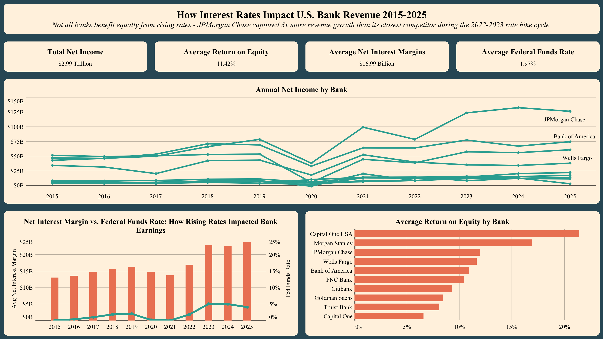

# FDIC Banking Analysis: How Interest Rates Impact Top US Bank Revenue (2015–2025)

Analyzing how Federal Reserve interest rate changes affect the financial performance of the top 10 US banks over a 10-year period using FDIC call report data, Python, and DuckDB.

---

## Executive Summary

This project examines the relationship between Federal Funds Rate movements and key profitability metrics across the top 10 US banks from 2015 to 2025. Using publicly available FDIC call report data, the analysis finds that rising interest rates, particularly the 2022–2023 hike cycle, corresponded with significant improvements in net interest margins across all banks, while the 2020 rate crash compressed margins simultaneously across the sector.

---

## Background

Interest rates set by the Federal Reserve directly influence how much banks earn on loans versus what they pay on deposits. As rates rise, banks generally benefit from wider spreads between lending and borrowing costs. This project was initiated to quantify that relationship using a decade of quarterly FDIC data and to identify which banks were most and least sensitive to rate changes.

---

## Purpose

- Determine whether net interest margins track Federal Funds Rate movements.
- Identify which of the top 10 US banks benefited most from the 2022–2023 rate hike cycle.
- Examine how the near-zero rate environment of 2020–2021 affected bank profitability.
- Produce a clean, analysis-ready dataset for visualization and further exploration.

---

## Key Questions

- Do banks earn more when interest rates rise?
- Which banks are most sensitive to rate changes?
- How did the 2020 rate crash and 2022–2023 rate hikes show up in bank performance?
- Is there a visible lag between Fed rate changes and reported bank profitability?

---

## Methods

1. Downloaded 44 quarterly CSV files from the FDIC BankFind Suite covering 2015–2025.
2. Loaded and merged all files into a single dataframe (231,650 rows, 161 columns).
3. Identified top 10 banks using string matching, accounting for FDIC non-standard naming conventions.
4. Selected 12 key financial metrics from 161 available columns.
5. Manually compiled Federal Funds Rate data by quarter from Federal Reserve historical records.
6. Merged rate data with bank financials by reporting date.
7. Used DuckDB SQL to standardize bank names, convert raw values to billions, and produce the final dataset.

---

## Tools

| Tool | Purpose |
|---|---|
| Python (pandas) | Data Loading, Cleaning, Transformation |
| DuckDB | SQL-Based Querying and Final Data Shaping |
| Tableau | Data Visualization |
| Google Colab | Development Environment |
| FDIC BankFind Suite | Source Data (44 Quarterly CSV Files) |

---

## Banks Analyzed

JPMorgan Chase, Bank of America, Wells Fargo, Citibank, Goldman Sachs, Morgan Stanley, PNC Bank, Truist Bank, Capital One, and Capital One USA.

---

## Results



Three charts produced:

1. **Annual Net Income by Bank** — Line chart comparing all 10 banks from 2015–2025.
2. **Avg Net Interest Margin vs Federal Funds Rate** — Dual-axis bar/line chart showing the NIM-rate relationship.
3. **Return on Equity (ROE) by Bank** — Line chart tracking profitability over time.

---

## Key Findings

- Net interest margins rose sharply in 2022–2023 alongside the Fed's aggressive rate hike cycle.
- JPMorgan Chase showed the strongest net income growth over the full period.
- The 2020 rate crash compressed net interest margins across all banks simultaneously.
- Smaller banks in the top 10 such as Truist and PNC showed more ROE volatility than mega banks.

---

## Limitations

- FDIC data uses non-standard bank naming conventions requiring manual string matching.
- Federal Funds Rate data for future 2025 quarters was estimated based on Fed projections.
- Capital One appears as two separate entities in FDIC records, requiring combined treatment.
- Analysis covers bank-level data only and does not account for holding company structures.

---

## Project Files

```
FDIC-Banking-Analysis/
│
├── README.md
├── FDIC_Data.ipynb
├── FDIC_Data.py
├── Bank_Data_Clean.xlsx
├── Bank_Query.sql
└── Bank_Analysis_Dashboard.png
```

---

## Data Sources

- FDIC BankFind Suite — publicly available quarterly call report data.
- Federal Funds Rate data manually compiled from Federal Reserve historical records.

---

## Author

**Giovanni Del Angel**
Co-op Data Analytics Fellow | Chicago, IL
[LinkedIn](https://linkedin.com/in/giovannidelangel) · [Tableau Public](https://public.tableau.com/app/profile/giovanni.del.angel/vizzes)
